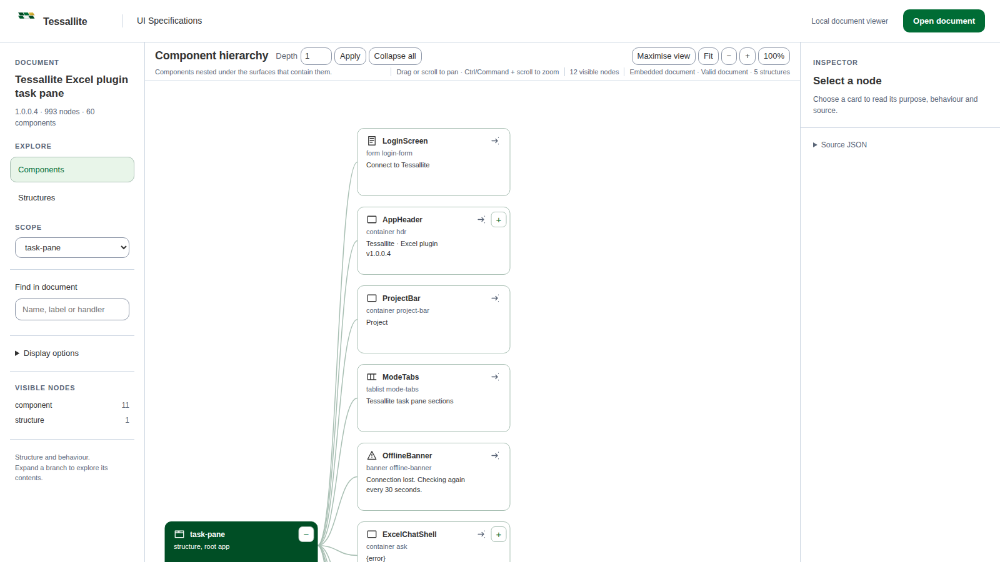
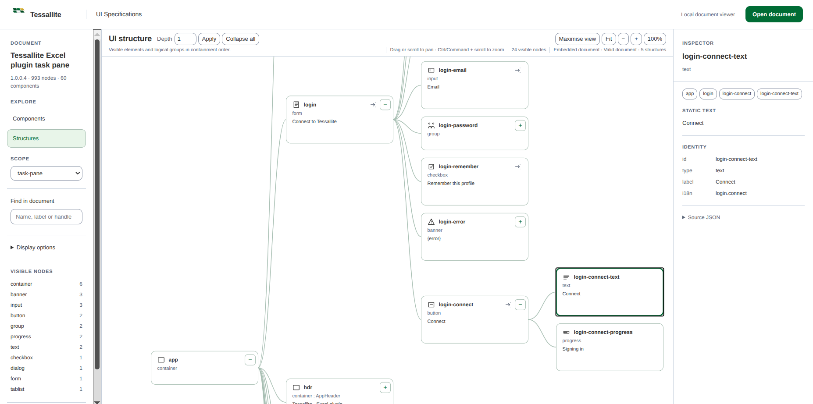
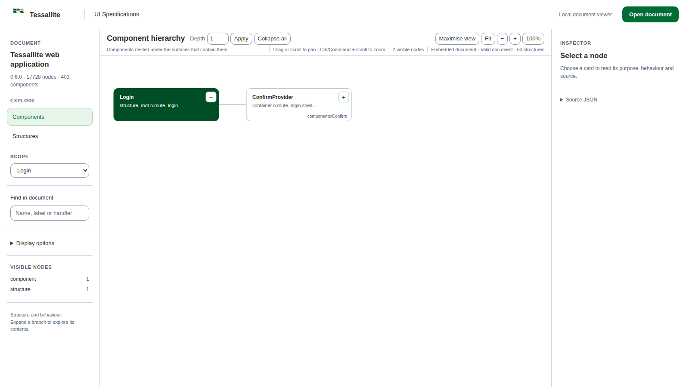

# Tessallite UI Specifications

Tessallite UI Specifications is a small language for describing a user
interface in a way that both people and programs can understand.

Think of it as a building plan for an app:

- a **component** is a reusable part, such as a button or a dialog;
- a **structure** is one screen or surface;
- a **node** is one thing in that screen;
- a **child** is a thing inside another thing;
- an **event** says what happens after an action;
- a **state** says what can change, such as loading or selected.

The project does not build or run the product being described. It records the
product's shape and behaviour. That makes the same document useful to a
designer, a writer, a test tool and an AI coding assistant.

The format extends the component envelope from
[OpenUI](https://openuispec.org). The format rules live in
[SPEC.md](SPEC.md), and the machine-readable rules live in
[schema/tessallite-ui-specs.schema.json](schema/tessallite-ui-specs.schema.json).

## See it first

The viewer turns a document into a readable graph. Cards use small, embedded
line icons to show what they represent. Cards with literal captions show a
short text preview; selecting a card shows the complete text in the inspector.



*The Structures view follows the real containment tree. A card can be a window,
button, text node, dialog, group or another documented type.*



*The inspector gives the selected node's purpose, identity, static text,
behaviour and source link.*



*The same viewer can open a large source-derived application document. It starts
small and expands branches as you explore them.*

More screenshot notes and alt text are in
[docs/screenshots.md](docs/screenshots.md). The images are examples of the
viewer, not part of the specification format.

## Start here

Use a Node.js release that satisfies the `engines.node` entry in `package.json`.

```sh
git clone https://github.com/M-O-Othman/Tessallite-UI-Specs.git
cd Tessallite-UI-Specs
npm install
npm run check
```

`npm run check` builds the TypeScript packages, builds the offline viewer,
validates the example documents and runs the test suite.

Validate a document:

```sh
node packages/cli/dist/index.js validate examples/containment.json
```

Open a document in the visualiser:

```sh
node packages/cli/dist/index.js view examples/containment.json --out /tmp/containment.html
```

Open `/tmp/containment.html` in a browser. The page is self-contained: it has
the document, the validator, the graph and the styles inside one file.

## The five pieces

| Piece | What it does | Where it lives |
|---|---|---|
| Format | Describes components, screens, nodes and behaviour. | `SPEC.md`, `schema/`, `vocabulary/` |
| Core library | Loads JSON/YAML, validates it and answers queries. | `packages/core/` |
| CLI | Runs validation, queries and HTML export from a terminal. | `packages/cli/` |
| Visualiser | Shows a document as an expandable graph. | `packages/visualiser/` |
| MCP server | Gives a read-only AI tool connection over one document. | `packages/mcp-server/` |

The parts share the same core library. This is important: a file accepted by
the CLI is checked by the same rules used by the visualiser and MCP server.

## A tiny document

Here is a complete small example. The screen contains one button. The button
has a caption and an event describing what clicking it does.

```json
{
  "name": "Tiny app",
  "version": "1",
  "description": "A small example UI.",
  "tuis": "0.1",
  "components": {
    "SaveButton": {
      "description": "A button that saves the current work."
    }
  },
  "structures": {
    "editor": {
      "description": "The editor screen.",
      "root": {
        "id": "editor-screen",
        "type": "container",
        "children": [
          {
            "id": "save",
            "type": "button",
            "component": "SaveButton",
            "label": "Save",
            "events": [
              {
                "event": "click",
                "handler": "handleSave",
                "actions": ["submit"],
                "effect": "Saves the current work."
              }
            ]
          }
        ]
      }
    }
  }
}
```

The `id` is the node's name inside the document. The `type` tells us what it
is. `component` links the button to a reusable definition. `label` is what a
person sees or hears. The event has a real handler name, an action and a plain
sentence about the result.

## Read and query a document

The CLI prints JSON, so its output can be used by another program.

```sh
# List screens and other surfaces
node packages/cli/dist/index.js query examples/containment.json structures

# Show the first two levels of one screen
node packages/cli/dist/index.js query examples/containment.json tree dashboard --depth 2

# Find buttons whose text contains “delete”
node packages/cli/dist/index.js query examples/containment.json find --type button --text delete

# Find the place where a handler is wired
node packages/cli/dist/index.js query examples/containment.json find --event onConfirmDelete

# Follow the parent chain to a node
node packages/cli/dist/index.js query examples/containment.json path-to results-cell-value

# List a node's events or direct children
node packages/cli/dist/index.js query examples/containment.json events-of delete-button
node packages/cli/dist/index.js query examples/containment.json children-of dashboard
```

The detailed query guide, including what a result means, is in
[docs/project-guide.md](docs/project-guide.md).

## Use the visualiser

1. Run `npm run build`.
2. Open `packages/visualiser/dist/visualiser.html`, or open an HTML page made
   by `tuis view`.
3. Choose **Open document** and select a `.json`, `.yaml` or `.yml` file.
4. Choose **Components** to see reusable parts under their screens.
5. Choose **Structures** to see every contained node in document order.
6. Click a card to read its details. Click `+` to open a branch and `−` to
   close it.

The graph starts at a readable size. Drag or use the normal mouse wheel to pan.
Hold Ctrl (Windows/Linux) or Command (macOS) while scrolling to zoom. **Fit**
shows the whole graph, **100%** returns to normal scale, and **Maximise view**
gives the graph all available space. Press Escape to restore the surrounding
panels.

The left panel can limit the surface, search by name/label/handler, hide
logical groups or leaves, hide overlays and show detail branches. The right
panel shows the selected node's purpose, static text, identity, events,
properties, states, accessibility facts and source implementation when those
facts exist.

The viewer's icons are local monochrome SVG paths. It never downloads an icon
from a document's `icon` URL. Dynamic bindings are shown as bindings, not
pretended to be literal text.

## Authoring rules in plain language

The complete rules are in [SPEC.md](SPEC.md). The short version is:

- Give every node a unique `id`.
- Put one screen or surface under `structures`.
- Put reusable parts under `components`.
- Use `kind: "logical"` only for a group that is not itself seen or operated.
- Give visible or interactive nodes a `type` and a `label` or `i18n` key.
- Put children in the order a reader meets them.
- Use one child with `repeat: true` for a list of many similar things.
- Put a table's column definitions on `columns`, not in fake column nodes.
- Put an overlay under the node that owns or opens it.
- Use the handler name that exists in source code; do not invent one.
- Describe the user's result in `effect`.
- Store changing values as `data` bindings, not made-up sample values.
- Record source locations in `implementation` when the document comes from
  code.
- Do not put CSS, colours, dimensions or screen coordinates in this format.

After authoring, run `tuis validate file.json` and test the queries a reader
will use. If validation fails, fix the cause rather than hiding the message.

## MCP for read-only AI access

Build first, then start one server for one document:

```sh
node packages/mcp-server/dist/index.js examples/containment.json
```

The server speaks MCP over standard input and output. It offers
`list_structures`, `get_tree`, `get_node`, `find`, `path_to`, `events_of`,
`children_of` and `validate`. It does not edit the document. A client can ask
for a small tree first, then request only the node or event it needs.

For example, a client can ask `find` for `event: "onConfirmDelete"`, use
`path_to` to learn where the control lives, and use `events_of` to read its
effect. This is easier and safer than sending the entire file every time.

## Test and change the project

Useful commands:

```sh
npm run build              # compile packages and build the offline viewer
npm run validate:examples  # validate the two checked-in examples
npm test                   # run Vitest
npm run check              # run all normal checks
```

Tests check behaviour, not just the presence of functions. They cover loading,
schema rules, semantic rules, queries, MCP tools, graph layout, card icons,
static text, zoom, selection, search, expansion and exported-page behaviour.

When changing the project:

1. Read `AGENTS.md`, the active plan in `work/` and the latest session handout.
2. Find the smallest owning package.
3. Make the change with a focused test.
4. Run the full check command.
5. Check documentation, indexes and source/consumer field names.
6. Record a real bug in `docs/known_issues.md` if one was found or fixed.

Do not change a public field name casually. The schema, TypeScript types,
validator, CLI, visualiser, MCP server and examples must agree.

## Privacy and safety

Documents can describe private applications. Keep private JSON, source dumps,
credentials and customer data in the owning private repository. Do not paste
tokens into examples or logs. The viewer is designed to work offline, and the
MCP server is read-only, but a person who receives a document can still read
its contents.

The specification describes structure and behaviour; it is not proof that the
real product works. A passing schema check means the document follows the
format. A passing unit test means the tested code behaved as expected. A real
browser check or deployed application check is a separate kind of evidence.

## Repository map

| Path | Purpose |
|---|---|
| `SPEC.md` | Normative field meanings and semantic rules. |
| `schema/` | JSON Schema for field shapes and required values. |
| `vocabulary/` | Allowed node types, actions and states. |
| `mappings/` | How source manifests map to this format. |
| `examples/` | Small synthetic documents used for learning and tests. |
| `packages/core/` | Parser, document model, validator and queries. |
| `packages/cli/` | Terminal commands and HTML export. |
| `packages/mcp-server/` | Read-only MCP server. |
| `packages/visualiser/` | Offline graph viewer and its tests. |
| `docs/` | User guide, known issues, project guide, questions, screenshots and indexes. |
| `work/` | Plans and session handouts for in-progress work. |
| `AGENTS.md` | Source-authoring and source-consuming procedure. |

## Read next

- [Detailed project guide](docs/project-guide.md)
- [Normative specification](SPEC.md)
- [Authoring and consuming procedure](AGENTS.md)
- [User guide](docs/user-guide.md)
- [Node types](vocabulary/node-types.md)
- [Actions](vocabulary/actions.md)
- [States](vocabulary/states.md)
- [Examples](examples/)
- [Documentation index](docs/_INDEX.md)
